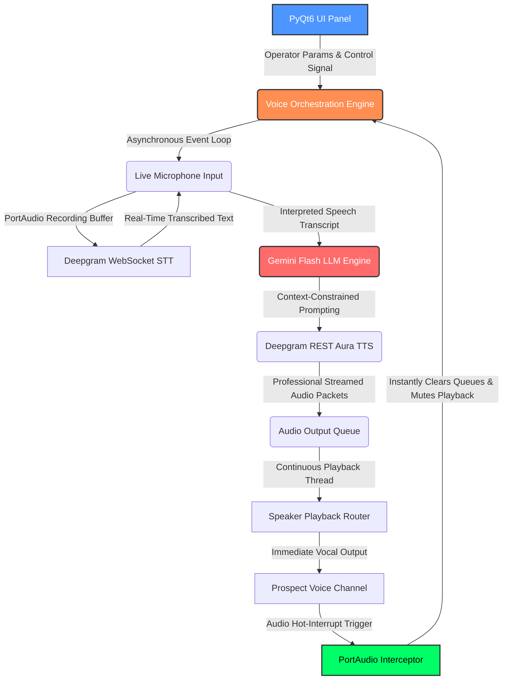

# Enterprise Voice-to-Voice AI Agent (Proof of Concept)

## Overview

This repository houses an **Enterprise Proof of Concept Working Model** developed by **ABT Plus LLC (Automated Business Technologies)**. It demonstrates our capability to architect, deploy, and manage ultra-low-latency, real-time Voice-to-Voice AI pipelines designed specifically for high-stakes B2B environments.

This software serves as a showcase of our technical proficiency in engineering production-grade AI solutions for businesses. It is engineered to handle fast-paced conversational AI tasks, simulating real-world sales and discovery workflows without the lag typically associated with cloud-dependent wrappers.

---

## 📊 Architectural Workflow

The system utilizes an asynchronous orchestration layer to decouple speech interfaces from the cognitive LLM pipeline, guaranteeing extreme efficiency and instant conversational responses.

---

## Core Capabilities Highlighted

*   **Asynchronous Orchestration:** The pipeline utilizes advanced Python `asyncio` threading boundaries. Audio capture, Large Language Model (LLM) processing, and Text-to-Speech (TTS) generation operate in fully decoupled, non-blocking loops to ensure zero stutter during operation.
*   **Hardware-Level Latency Mitigation:** The architecture features custom hot-interrupt frameworks built on top of local C-level audio binaries (`sounddevice`/`portaudio`). This allows a human operator to instantly seize control of a live call, bypassing the AI buffer in real-time.
*   **Enterprise AI Integration:** Integrates enterprise-tier models, including Deepgram `flux-general-en` for immediate turn-detection STT and `aura-2-odysseus-en` for professional vocal delivery, powered by highly constrained, brand-aligned LLM logic (Gemini 2.5 Flash).
*   **Strict Security Posture:** Explicit secret management. No API keys or environmental parameters are hardcoded; all sensitive configurations are enforced via immutable dataclass wrappers injected strictly at runtime.

## Future Integration: Smartech B2B Infrastructure

This Voice AI module is designed to integrate seamlessly with our upcoming **Smartech** data automation infrastructure. Smartech is engineered to perform massive-scale job matrix scanning and automated qualification of high-value B2B prospects. Combined with this voice agent, ABT Plus LLC provides an end-to-end autonomous outreach and discovery pipeline.

## Technical Stack

*   **Orchestration:** Python 3.11+, `asyncio` Event Loops, `threading`
*   **Speech-to-Text (STT):** Deepgram Native WebSocket Streaming
*   **Language Model (LLM):** Google Generative AI (Gemini Flash Architecture)
*   **Text-to-Speech (TTS):** Deepgram REST Streaming
*   **Hardware Audio Interface:** `sounddevice` (PortAudio wrapper)
*   **User Interface:** PyQt6 (Native Desktop Integration with IPC Single-Instance Locking)

## About ABT Plus LLC

ABT Plus LLC specializes in high-performance private AI automation pipelines, multi-agent workflow engineering, and custom local LLM hosting layouts designed to eliminate extreme cloud fees and maintain absolute data sovereignty for our enterprise clients.

*To book an enterprise discovery session or inquire about custom software solutions for your business, visit us at [www.abtplusllc.com](http://www.abtplusllc.com).*

---

## ⚖️ Open-Source Disclaimer & Operational Boundary
This repository is an open-source architectural Proof of Concept (PoC) engineered strictly for technical study, local environment evaluation, and middleware infrastructure orchestration sandbox testing.
* **Liability:** The software is provided "as is", without warranty of any kind. ABT PLUS LLC assumes zero liability or financial tracing responsibility for API token configurations, webhook connection bills, or third-party telephony accounts (e.g., Twilio) linked to this open-source framework.
* **Compliance:** Users bear sole individual responsibility for ensuring automated telephony streams and voice-cloning testing conform to regional carrier standards, telecom regulations, and platform Terms of Service.
